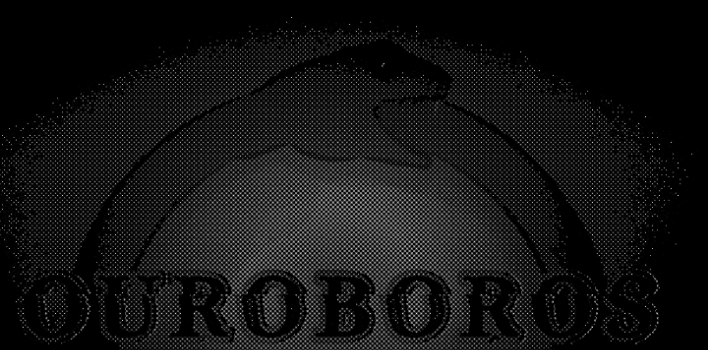

<div align="center">
  
</div>
<h1 align="center">OUROBOROS</h1>
<p align="center"> 
  
  
  
</p>
<p align="center"> 
   A DIY wireless security research tool built on ESP32 DevKit v1.
</p>

## Getting Started

### Prerequisites
* **PlatformIO** installed in VS Code or the CLI-base
* **TFT_eSPI Library:** You must configure `User_Setup.h` within your local library folder to match your display driver (ST7735) and pin mappings provided above.
* **Drivers:** Ensure you have the CP210x or CH340 driver installed for your ESP32 board to be recognized by your computer.
---
## Disclaimer

  This tool is designed for research, educational, and authorized testing purposes only. Using this device against networks or devices without explicit, written permission from the owner is illegal. The author assumes no responsibility for any misuse or damage caused by this project.

---

## Hardware

| Component | Part |
|---|---|
| MCU | ESP32 DevKit v1 (WROOM-32) |
| Display | 1.44" ST7735 TFT (128×128) |
| Sub-GHz Radio | CC1101 |
| Navigation | 4× Tactile buttons |

---

## Features

### WiFi
- Scanner: Full AP discovery including hidden SSID detection.
- Deauthentication: Broadcast or target-specific deauth attacks with a scrollable UI picker.
- Beacon Spam: Randomized SSID rotation across all channels for network saturation testing.
- Probe Sniffer: Passive channel-hopping to capture and identify probe requests.
- RSSI Mapper: Live, auto-refreshing (3s) AP list with real-time channel signal graphing.
- Frame Builder: Manual IEEE 802.11 frame construction (Beacon, Probe, Auth, Deauth, Association).
- Evil Twin: Standalone Rogue AP implementation supporting OPEN_NETWORK, WPA2_MIMIC, and CAPTIVE_PORTAL.

### Bluetooth
- BLE Scanner: Real-time identification of nearby Bluetooth Low Energy devices.
- BLE Advertising: Automated spamming of popular protocols (Apple, Samsung Fast Pair, Windows Swift Pair).
- BLE Jammer: Targeted disruption of BLE connections, including passive sniffing and active channel jamming for connection interference.

### Sub-GHz (CC1101)
- Signal scanner with RSSI bar graph
- Raw signal capture
- Raw signal replay
- Rolling code detector — analyzes captures, tells you if a remote is fixed or rolling code
- Full config: frequency (300–928 MHz), modulation, bandwidth, TX power, packet length
- NVS persistence — config survives reboots

---

## Wiring

### ST7735 Display (SPI)
| Pin | ESP32 |
|---|---|
| VCC | 3.3V |
| GND | GND |
| CS | GPIO 5 |
| RESET | GPIO 4 |
| DC/A0 | GPIO 2 |
| SDA/MOSI | GPIO 23 |
| SCK | GPIO 18 |
| LED/BL | 3.3V |

### CC1101 (shared SPI bus)
| Pin | ESP32 |
|---|---|
| VCC | 3.3V |
| GND | GND |
| MOSI | GPIO 23 |
| MISO | GPIO 19 |
| SCK | GPIO 18 |
| CSN | GPIO 15 |
| GDO0 | GPIO 22 |
| GDO2 | GPIO 21 |

> Both devices share MOSI/SCK on GPIO 23/18. CS pins (5 and 15) keep them separate.

### Buttons (active LOW, internal pull-up — one leg to GPIO, other to GND)
| Button | ESP32 |
|---|---|
| UP | GPIO 12 |
| DOWN | GPIO 13 |
| SELECT | GPIO 14 |
| BACK | GPIO 27 |

<div align="center">
  
  <p>still working on the design🥹🥹🥹</p>
</div>

---

## Button Controls

| Button | Press | Long Press | Double Click |
|---|---|---|---|
| UP | Cursor up / value +1 | Fast increment | Jump to top |
| DOWN | Cursor down / value -1 | Fast decrement | Jump to bottom |
| SELECT | Enter / confirm | **Start/stop module** | Secondary action |
| BACK | Go back | **Jump to main menu** | — |

---

## Project Structure

```
ouroboros/
├── src/
│   ├── main.cpp
│   ├── ui/
│   │   ├── Display.h/cpp         # TFT_eSPI wrapper + themed draw calls
│   │   ├── Menu.h/cpp            # State machine menu
│   │   ├── Ouroboros.h/cpp       # Animated snake spinner
│   │   └── ConfigScreen.h/cpp    # Sub-GHz interactive config editor
│   ├── modules/
│   │   ├── WiFiAttack.h/cpp      # Scan, deauth, beacon spam, probe sniff
│   │   ├── WiFiMapper.h/cpp      # RSSI mapper — AP list + channel graph
│   │   ├── BLEModule.h/cpp       # BLE scan + spam
│   │   ├── SubGHz.h/cpp          # CC1101 scan / capture / replay
│   │   ├── RollingCodeDetector.h/cpp  # Fixed vs rolling code analysis
│   │   ├── DeauthPicker.h/cpp    # AP target selector
│   │   ├── EvilTwinModule.h/cpp  # OPEN_NETWORK, WPA2_MIMIC, CAPTIVE_PORTAL
│   │   ├── FrameConstructionModule.h/cpp # Non-blocking state machine + GATT characteristic integration
│   │   ├── NVSConfig.h/cpp       # Persistent config via ESP32 NVS
│   │   └── BLESnifferJammer.h/cpp # BLE Jammer
│   └── utils/
│       └── Buttons.h/cpp         # OneButton — click / long / double
├── include/
│   └── config.h                  # Pins, colors, constants
├── platformio.ini
└── README.md
```
---

## Dependencies

```ini
lib_deps =
    bodmer/TFT_eSPI
    lsatan/SmartRC-CC1101-Driver-Lib
    mathertel/OneButton
```

---

## Build & Flash

```bash
git clone https://github.com/yourusername/ouroboros
cd ouroboros
pio run --target upload
pio device monitor --baud 115200
```

---

This project is licensed under the **MIT License** - see the [LICENSE](LICENSE) file for details.
